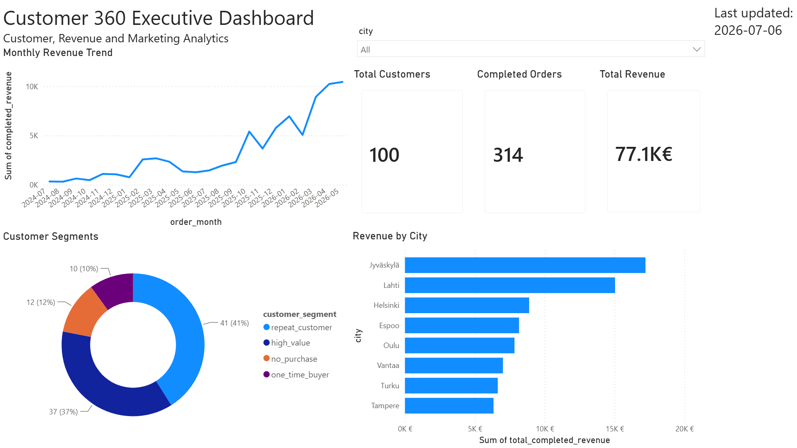
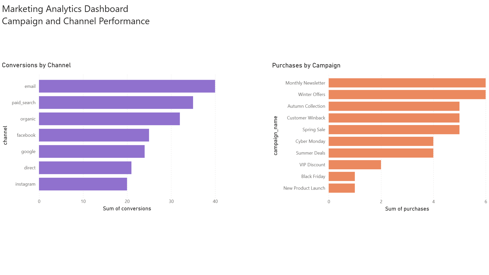
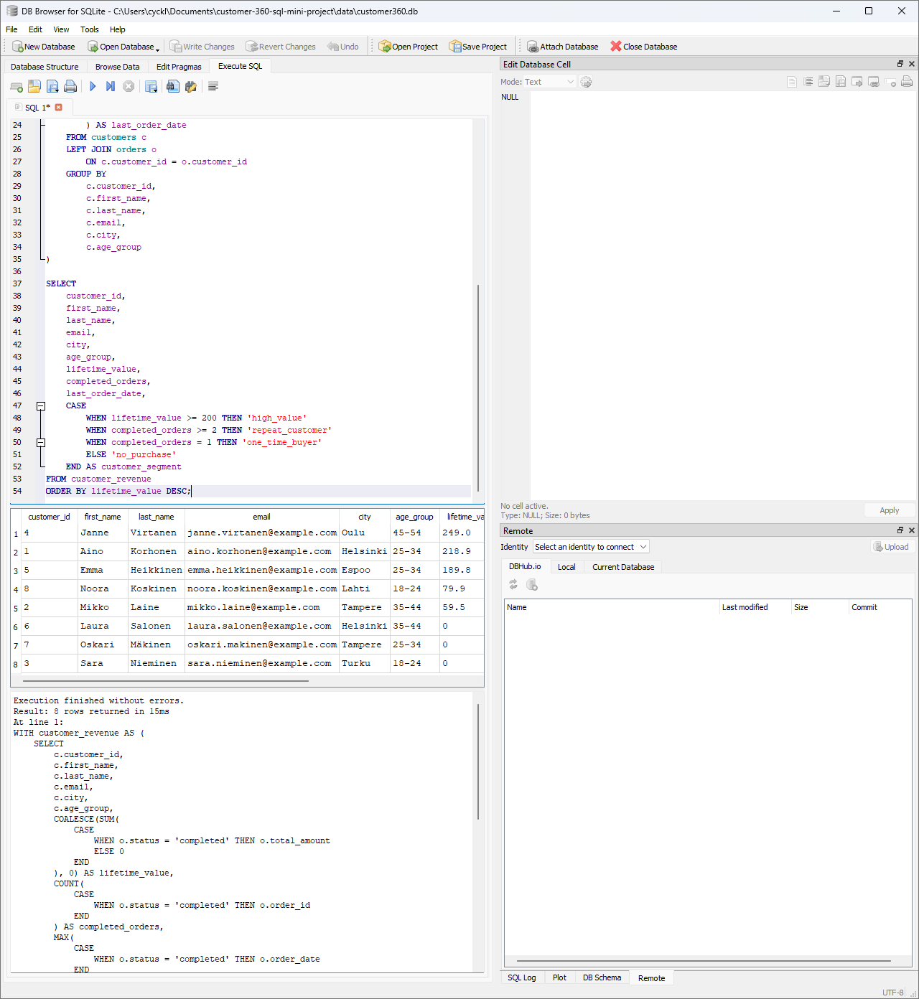
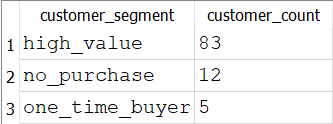
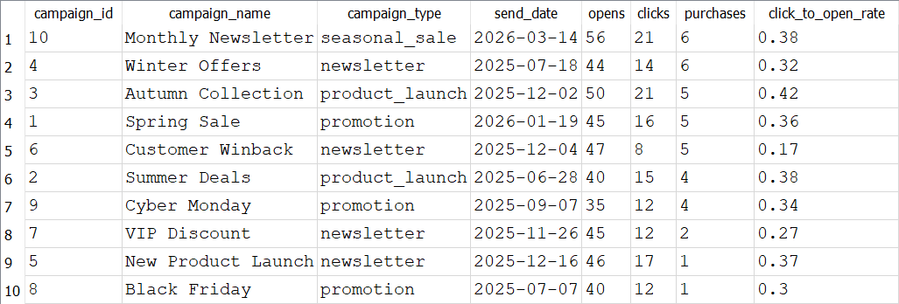
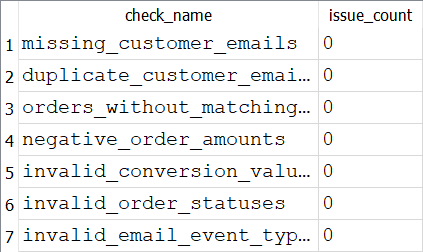
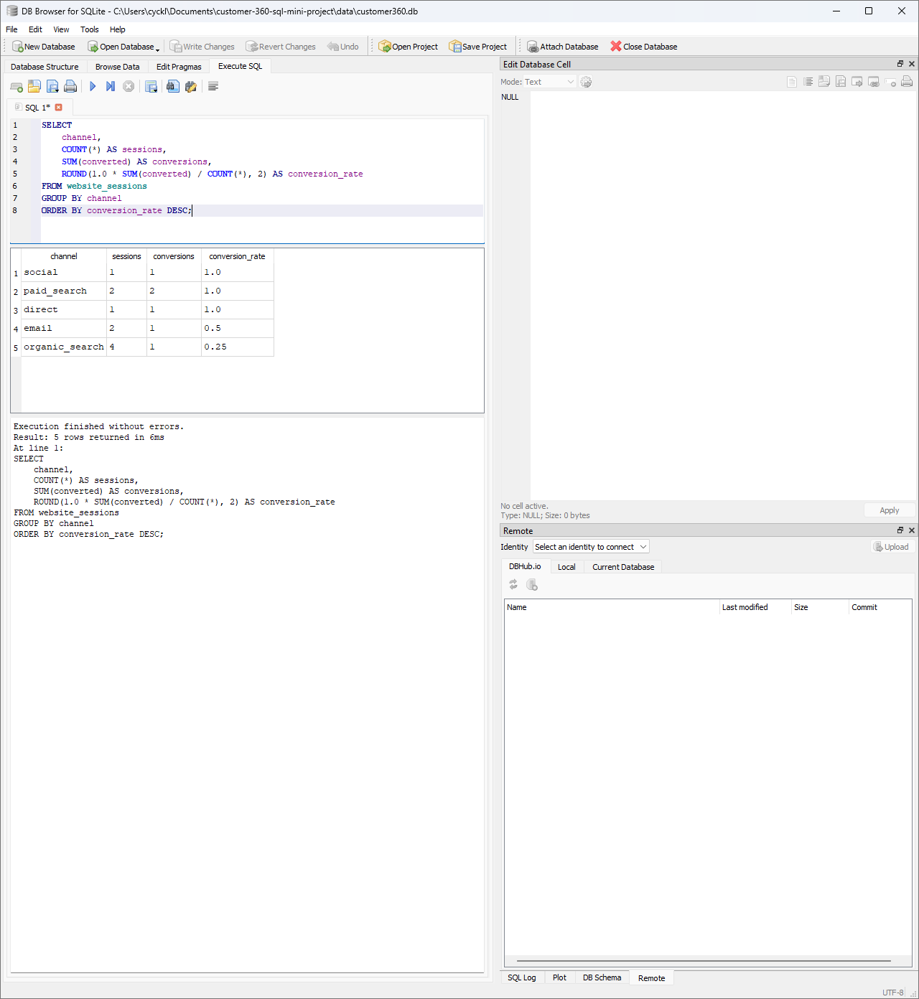
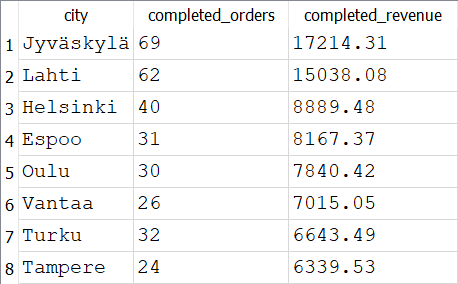

# Customer 360 SQL Mini Project

A portfolio project demonstrating SQL, Python, ETL and analytics engineering concepts using a fictional e-commerce Customer 360 dataset.

## Business context

A fictional e-commerce company wants to understand:

- who their most valuable customers are
- which customers have given marketing consent
- how much revenue has been generated monthly
- which website channels convert best
- how email campaigns perform
- whether there are data quality issues in the dataset

## Database structure

The project contains five relational tables:

| Table | Description |
|---|---|
| `customers` | Customer master data such as name, email, city, age group and marketing consent |
| `orders` | Customer orders, revenue, order date and order status |
| `website_sessions` | Website visits, acquisition channels, landing pages, device types and conversions |
| `email_campaigns` | Email campaign metadata |
| `email_events` | Email opens, clicks and purchase events |

## Architecture

The project follows a simple end-to-end analytics architecture:

Synthetic Data Generation (Python)
            ↓
         CSV Files
            ↓
      Python ETL Pipeline
            ↓
      Azure SQL Database
            ↓
      Analytics SQL Views
            ↓
      Power BI Dashboards

## Power BI Dashboards

The project includes two interactive Power BI dashboards:

### Executive Dashboard

Provides an overview of:

- customer segmentation
- monthly revenue trends
- completed orders
- total revenue
- revenue by city



### Marketing Analytics Dashboard

Provides insights into:

- conversion performance by acquisition channel
- purchases generated by marketing campaigns



## Power BI Features

- Interactive city filtering
- Cross-filtering between visualizations
- KPI cards
- Customer segmentation dashboard
- Marketing performance dashboard
- Azure SQL data connectivity
- Data model relationships

## Documentation

Additional documentation:

- [Data model](docs/data-model.md)
- [Project architecture](docs/project-architecture.md)

## SQL files

| File | Description |
|---|---|
| `01_create_tables.sql` | Creates the database tables |
| `02_insert_sample_data.sql` | Inserts sample customer, order, website and email data |
| `03_basic_analysis.sql` | Basic SQL analysis queries |
| `04_customer_segments.sql` | Customer segmentation analysis |
| `05_campaign_performance.sql` | Email campaign performance analysis |
| `06_data_quality_checks.sql` | Data quality validation queries |
| `07_create_views.sql` | Creates reusable analytics views |
| `08_view_analysis.sql` | Example analysis queries using the views |
| `09_generated_data_analysis.sql` | Analysis on revenue, completed orders, channel conversion and channel performance |
| `10_create_analytics_views.sql` | Customer lifetime value and channel conversion performance views |
| `11_data_quality_checks.sql` | Data quality checks |
| `12_revenue_trends.sql` | Analysis on revenue trends |
| `13_rfm_analysis.sql` | Customer analysis on the recency, frequency and monetary metrics |
| `14_cohort_analysis.sql` | Average completed orders, revenue per customer and total cohort |

## Skills demonstrated

This project demonstrates:

- SQL table creation
- primary keys and foreign keys
- relational data modeling
- `SELECT`
- `WHERE`
- `GROUP BY`
- `ORDER BY`
- `JOIN` and `LEFT JOIN`
- aggregate functions such as `COUNT`, `SUM` and `MAX`
- `CASE WHEN`
- Common Table Expressions
- data quality checks
- customer segmentation
- marketing analytics
- reusable SQL views
- analytics layer design
- data model documentation
- data quality validation

## Example business questions answered

### 1. Who are the most valuable customers?

The customer lifetime value query combines customer and order data to calculate completed revenue per customer.

### 2. Which customers belong to each customer segment?

Customers are classified into segments:

- `high_value`
- `repeat_customer`
- `one_time_buyer`
- `no_purchase`

### 3. Which website channels convert best?

The channel performance query calculates sessions, conversions and conversion rate by acquisition channel.

### 4. How did email campaigns perform?

The campaign performance query calculates:

- opens
- clicks
- purchases
- click-to-open rate

### 5. Can the data be trusted?

The data quality checks look for:

- missing customer emails
- duplicate customer emails
- orders without matching customers
- negative order amounts
- unknown website channels
- invalid conversion values
- invalid order statuses
- invalid email event types

## Example results

### Customer segmentation



### Segment summary



### Campaign performance



### Data quality summary



### Channel conversion rate



### Revenue trends



## How to run with DB Browser for SQLite

1. Create and activate virtual environment
2. Install requirements
3. Generate synthetic datasets
4. Load datasets into SQLite
5. Run analysis queries
6. Run the analysis queries from

## Azure SQL Migration

As part of this project, the local SQLite-based Customer 360 dataset was migrated to Microsoft Azure SQL Database.

### Azure Resources

- Azure SQL Database (Serverless)
- Azure SQL Server
- Azure Resource Group
- SQL Server Management Studio (SSMS)

### Migration Steps

1. Created an Azure SQL Database using Azure for Students.
2. Configured firewall rules to allow client access.
3. Connected to the database using SQL Server Management Studio (SSMS).
4. Recreated the Customer 360 database schema in Azure SQL.
5. Developed a Python ETL script using:
   - pandas
   - pyodbc
   - python-dotenv
6. Loaded CSV datasets into Azure SQL tables.

### Data Loaded

| Table | Rows |
|---------|---------:|
| customers | 100 |
| email_campaigns | 10 |
| orders | 577 |
| website_sessions | 842 |
| email_events | 1379 |

### Technologies Used

- Microsoft Azure SQL Database
- SQL Server Management Studio (SSMS)
- Power BI Desktop
- Python
- pandas
- pyodbc
- python-dotenv
- Git
- GitHub

### Validation

After loading the data, table contents were validated directly in Azure SQL using SSMS queries.

Example:

```sql
SELECT COUNT(*) FROM customers;
SELECT COUNT(*) FROM orders;
SELECT COUNT(*) FROM website_sessions;
SELECT COUNT(*) FROM email_campaigns;
SELECT COUNT(*) FROM email_events;
```

### Skills Demonstrated

- Cloud database deployment
- Azure SQL configuration
- SQL schema creation
- ETL pipeline development
- Python database connectivity
- Data migration from flat files to cloud database
- Cloud data validation

## Project Status

The project currently includes:

- synthetic data generation with Python
- SQLite analytics database
- migration to Azure SQL Database
- Python ETL pipeline
- analytical SQL views
- interactive Power BI dashboards
- customer segmentation
- marketing analytics
- cohort analysis
- revenue trend analysis
- data quality validation

## Current Features

- Python-based synthetic data generation
- SQLite analytics database
- customer segmentation analysis
- campaign performance analytics
- cohort analysis
- revenue trend analysis
- analytics views
- data quality validation queries
- ETL-style CSV loading pipeline

## Future Improvements

Possible future enhancements:

- Incremental ETL loading
- Automated refresh scheduling
- Additional Power BI dashboards
- Customer churn prediction
- RFM segmentation dashboard
- Databricks / PySpark implementation
- Containerized deployment with Docker

## Key Learnings

This project provided hands-on experience with:

- designing relational databases
- building ETL pipelines in Python
- migrating data to Azure SQL Database
- creating analytical SQL views
- data quality validation
- dimensional data modeling
- building interactive Power BI dashboards
- integrating cloud databases with BI tools